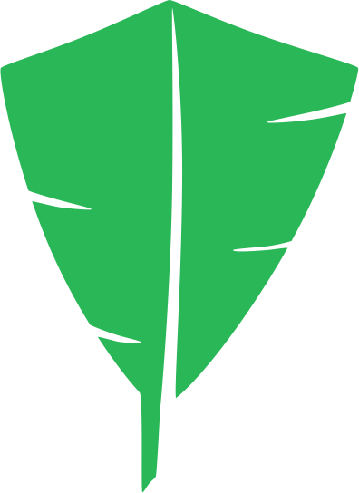

# feathers-casl

<p align="center">
    
</p>


[](https://github.com/fratzinger/feathers-casl/blob/master/LICENSE)

## About

Add access control with CASL to your feathers application.

This project is built for [FeathersJS](http://feathersjs.com). An open source web framework for building modern real-time applications.
It's based on [CASL](https://casl.js.org/) and is a convenient layer to use **CASL** in feathers.js.

## Documentation

https://feathers-casl.netlify.app/

## Installation

```bash
npm i feathers-casl
```

## Testing

Simply run `npm test` and all your tests in the `test/` directory will be run.


## Help

For more information on all the things you can do, visit [the generator](https://generator.feathers-plus.com/), [FeathersJS](http://docs.feathersjs.com) and [CASL](https://casl.js.org/v5/en/).


## License

Licensed under the [MIT license](LICENSE).